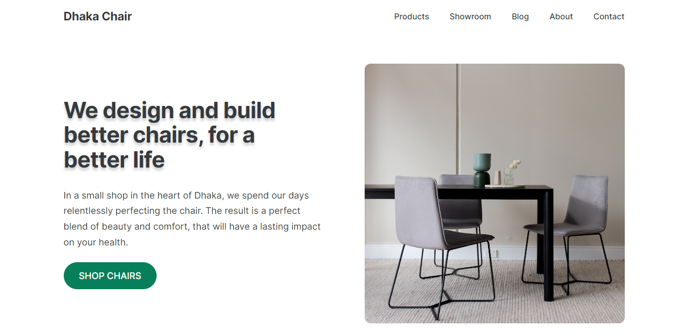

<h1 align="center">Dhaka Chair Shop</h1>

<p align="center"></p>

<p>In a small shop in the heart of Dhaka, we spend our days
              relentlessly perfecting the chair. The result is a perfect blend
              of beauty and comfort, that will have a lasting impact on your
              health.</p>

<h2>🧐 Sections</h2>

Here're the section of the project's:

- Hero section
- Features section
- Testimonial
- Card
- Footer

<h2>🚀 Demo</h2>

[https://dhaka-chair-shop.netlify.app/](https://dhaka-chair-shop.netlify.app/)

<h2>Project Screenshots:</h2>


<h2>🛠️ Installation Steps:</h2>

<p>1. Clone the repository</p>

```
git clone repo_url
```

<h2>💻 Built with</h2>

Technologies used in the project:

- [html](#) - For desgin the skeleton
- [css](#) - For styleing

<h2>💖Like my work?</h2>

This project needs a ⭐️ from you. Don't forget to leave a star ⭐️.
